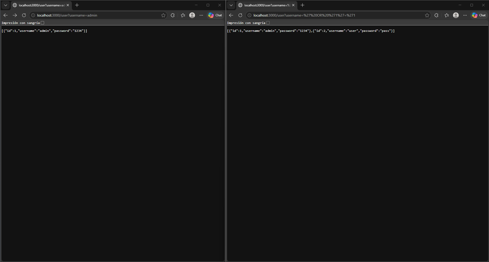
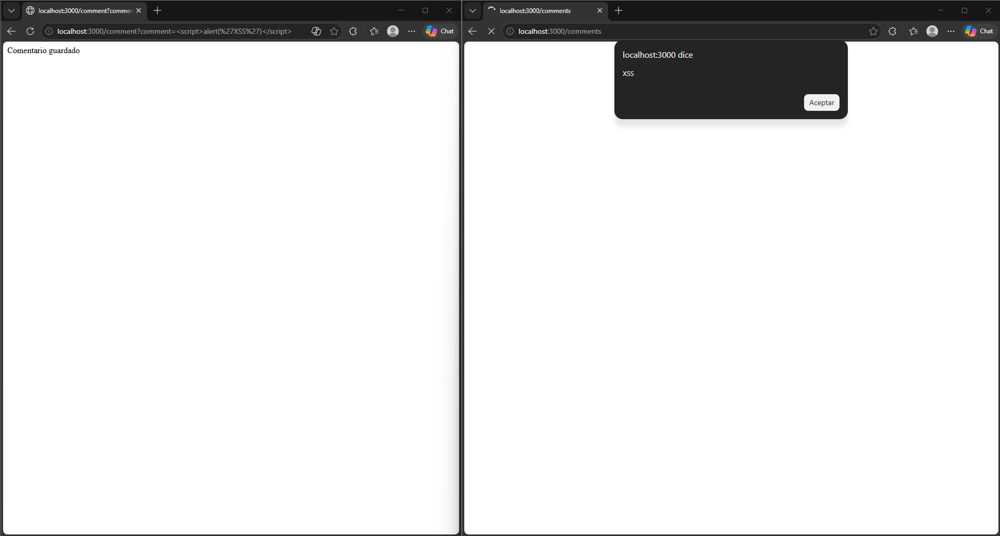
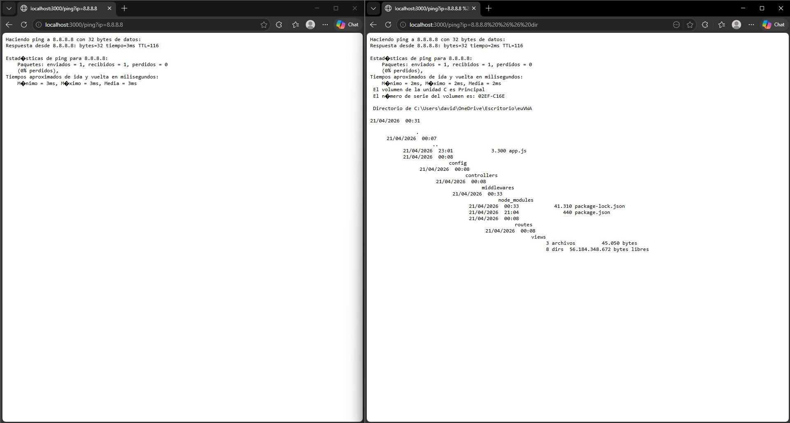
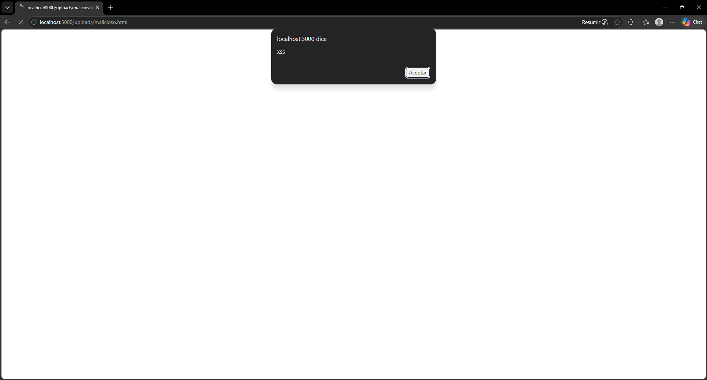
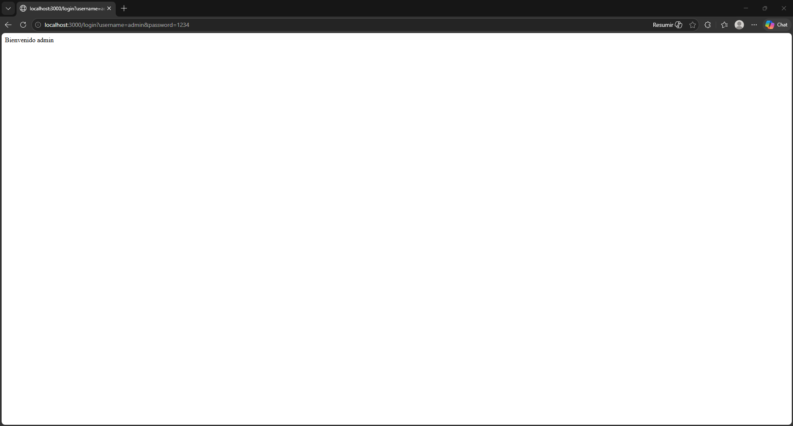
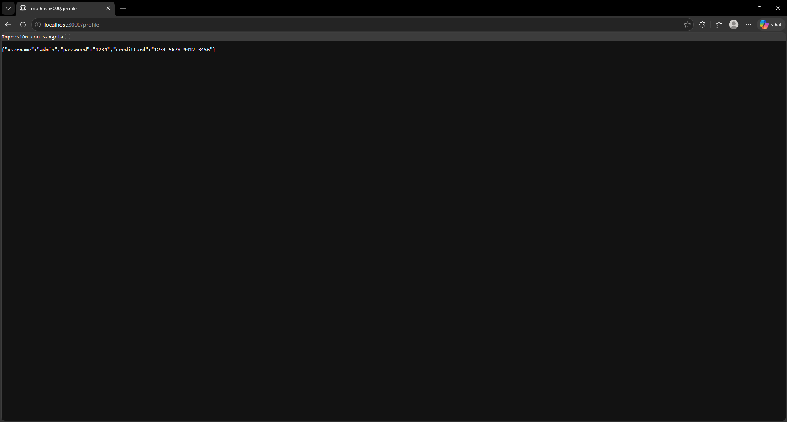
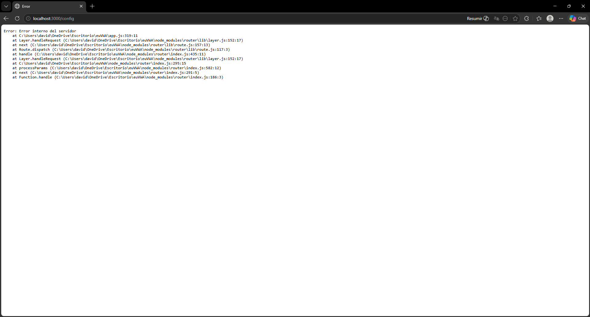

# euVWA - UE Vulnerable Web Application

Aplicación web vulnerable inspirada en DVWA, desarrollada en Node.js y Express, orientada al análisis y explotación controlada de vulnerabilidades incluidas en el OWASP Top 10.

Incluye dos versiones diferenciadas: 
- main-vulnerable: contiene vulnerabilidades intencionadas 
- main-secure: contiene las mismas funcionalidades corregidas aplicando buenas prácticas de desarrollo seguro

------------------------------------------------------------------------

## Objetivo del proyecto

El objetivo del proyecto es reproducir vulnerabilidades reales del OWASP Top 10 en un entorno Node.js + Express, junto con su correspondiente mitigación, permitiendo comparar de forma directa la versión vulnerable y la versión segura.

------------------------------------------------------------------------

## Requisitos

-   Node.js \>= 18
-   npm \>= 9

------------------------------------------------------------------------

## Instalación

    git clone https://github.com/ddrojovillalba/euVWA.git
    cd euVWA
    npm install

------------------------------------------------------------------------

## Ejecución

Versión vulnerable:

    git checkout main-vulnerable
    node app.js

Versión segura:

    git checkout main-secure
    node app.js

Servidor disponible en: http://localhost:3000

------------------------------------------------------------------------

## Arquitectura

La aplicación sigue una arquitectura modular basada en Express:

-   routes: definición de endpoints
-   controllers: lógica de negocio
-   middlewares: validaciones y controles de seguridad
-   views: renderizado de respuestas
-   uploads: almacenamiento de archivos

Esta separación permite mantener el código limpio, escalable y
fácilmente auditable desde el punto de vista de seguridad.

------------------------------------------------------------------------

## Estructura del proyecto

    euVWA/
    ├── controllers/
    ├── routes/
    ├── middlewares/
    ├── uploads/
    ├── views/
    ├── docs/
    │   └── img/
    ├── app.js
    ├── package.json

------------------------------------------------------------------------

## Vulnerabilidades implementadas

| Vulnerabilidad              | Endpoint   | Descripción                          | Solución aplicada                |
|---------------------------|------------|--------------------------------------|----------------------------------|
| SQL Injection             | /user      | Manipulación de consultas            | Validación de entrada            |
| XSS reflejado             | /search    | Inyección de scripts en respuesta    | Escape de HTML                   |
| XSS almacenado            | /comments  | Persistencia de scripts              | Sanitización de datos            |
| Command Injection         | /ping      | Ejecución de comandos del sistema    | Validación estricta              |
| Insecure File Upload      | /upload    | Subida sin restricciones             | Validación de tipo y nombre      |
| Broken Authentication     | /login     | Autenticación insegura               | Mejora del control de acceso     |
| Sensitive Data Exposure   | /profile   | Exposición de datos sensibles        | Eliminación de datos críticos    |
| Security Misconfiguration | /config    | Manejo incorrecto de errores         | Gestión segura de errores        |

------------------------------------------------------------------------

## Comparativa Vulnerable vs Secure

| Vulnerabilidad              | Versión vulnerable                     | Versión segura                         |
|---------------------------|----------------------------------------|----------------------------------------|
| SQL Injection             | Uso directo de input del usuario       | Validación y filtrado de entrada       |
| XSS reflejado             | Inserción directa en HTML              | Escape de caracteres HTML              |
| XSS almacenado            | Persistencia sin control               | Sanitización de datos                  |
| Command Injection         | Ejecución directa de comandos          | Validación estricta del input          |
| Insecure File Upload      | Subida sin restricciones               | Validación de tipo y nombre            |
| Broken Authentication     | Credenciales en texto plano            | Mejora del control de acceso           |
| Sensitive Data Exposure   | Datos sensibles expuestos              | Eliminación de información crítica     |
| Security Misconfiguration | Errores visibles                       | Manejo seguro de errores               |

------------------------------------------------------------------------

## Explicación técnica de las mitigaciones

- SQL Injection:
  En la versión vulnerable se utiliza directamente la entrada del usuario sin validación, permitiendo manipular la lógica de la consulta. En la versión segura se valida la entrada y se utiliza comparación estricta para evitar conversiones implícitas y entradas maliciosas.

- XSS reflejado:
  La versión vulnerable inserta directamente datos en el HTML. La versión segura aplica escape de caracteres especiales evitando la ejecución de código JavaScript.

- XSS almacenado:
  Los datos se almacenan sin control en la versión vulnerable. En la versión segura se sanitizan antes de almacenarse y mostrarse.

- Command Injection:
  La versión vulnerable ejecuta comandos del sistema con entrada directa del usuario. La versión segura valida estrictamente el formato permitido (por ejemplo IPs válidas).

- Insecure File Upload:
  La versión vulnerable permite subir cualquier archivo. La versión segura restringe extensiones, valida tipo MIME y evita archivos ejecutables.

- Broken Authentication:
  En la versión vulnerable las credenciales se manejan sin protección. En la versión segura se mejora la validación y el control de acceso.

- Sensitive Data Exposure:
  La versión vulnerable expone información crítica. La versión segura elimina datos sensibles y aplica el principio de mínimo privilegio.

- Security Misconfiguration:
  La versión vulnerable muestra errores internos. La versión segura oculta detalles técnicos y gestiona errores de forma controlada.

------------------------------------------------------------------------

## Evidencias de explotación

Las capturas se encuentran en el directorio docs/img/.

Evidencias de explotación correspondientes a cada vulnerabilidad en la versión vulnerable:

### SQL Injection


Se observa cómo mediante una entrada manipulada (' OR '1'='1) se altera la consulta SQL y se obtienen múltiples registros, evidenciando la ausencia de validación de entrada.

### XSS reflejado


Se inyecta código JavaScript en el parámetro de búsqueda, el cual es devuelto sin sanitización en la respuesta, provocando la ejecución del script en el navegador del usuario.

### XSS almacenado


El payload malicioso se almacena en el sistema (comentarios) y se ejecuta automáticamente cuando otros usuarios acceden a la página, demostrando la falta de sanitización persistente.

### Command Injection


Se observa cómo, mediante la manipulación del parámetro `ip`, se inyectan comandos adicionales (&& dir), permitiendo ejecutar instrucciones del sistema operativo en el servidor.

### Insecure File Upload


Se permite la subida de un archivo malicioso que posteriormente es accesible desde el servidor y ejecuta código en el navegador, evidenciando la falta de validación de archivos.

### Broken Authentication


Se accede al sistema utilizando credenciales simples y sin mecanismos de protección adecuados, evidenciando una autenticación débil y fácilmente explotable.

### Sensitive Data Exposure


Se muestran datos sensibles como credenciales y números de tarjeta en texto plano, evidenciando la ausencia de cifrado y protección de información crítica.

### Security Misconfiguration


El sistema expone errores internos junto con trazas completas, revelando información sensible sobre la estructura de la aplicación y facilitando posibles ataques.

------------------------------------------------------------------------

## Ejemplos de explotación

SQL Injection:

```
/user?username=' OR '1'='1
```

XSS reflejado:

```
/search?q=<script>alert('XSS')</script>
```

XSS almacenado:

```
/comment?comment=<script>alert('XSS')</script>
```

Command Injection:

```
/ping?ip=127.0.0.1 && dir
```

File Upload:

```
<script>alert('XSS')</script>
```

------------------------------------------------------------------------

## Conclusiones

El desarrollo realizado evidencia cómo las vulnerabilidades del OWASP Top 10 pueden ser explotadas en entornos reales, así como la relevancia de aplicar prácticas de desarrollo seguro para su mitigación. La existencia de versiones paralelas (vulnerable y segura) facilita la comprensión del impacto de cada vulnerabilidad y de las técnicas empleadas para su corrección.

------------------------------------------------------------------------

## Tecnologías

- Node.js
- Express
- Multer

------------------------------------------------------------------------

## Autor

David Rojo Villalba